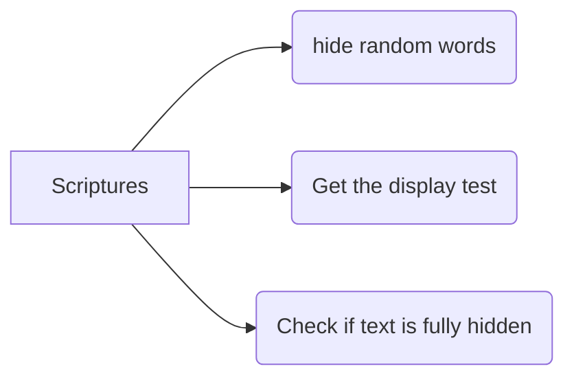
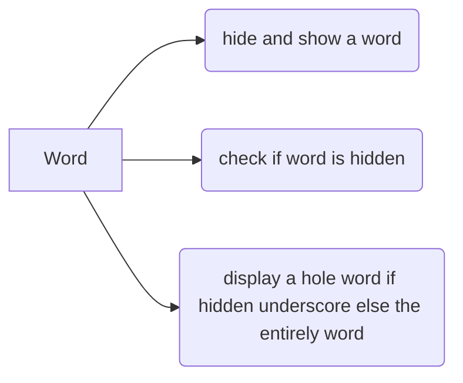
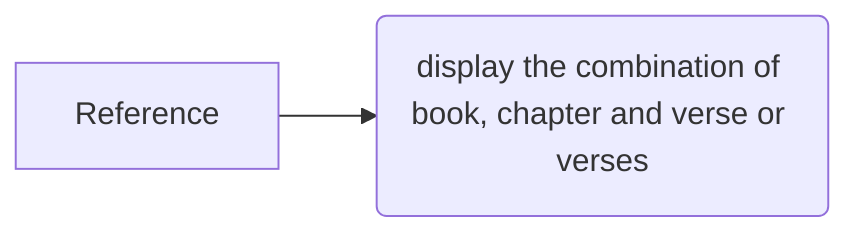

# Scripture Memorizer Design
1.  **What does the program do?**
		_Ans.: The program should display the full scripture and then hides a few words at a time until the complete scripture is hidden._
2.   **What user inputs does it have? **
		_Ans.: Enter to continue and type 'quit' to quit the program_
3.   **What output does it produce? **
		_Ans.: While the user continues pressing <enter> it will hide handom words._
4.   **How does the program end? **
		_Ans.: When there is no more words to be hidden the program stops or the user type the word quit_

Classes
**_To determine Classes Do the following questions:_**
What are good candidates for classes in this program?
What are the primary responsibilities of each class?

	-   `Scripture`: Keeps track of both the reference and the text of the scripture. Can hide words and get the rendered display of the text.
-   `Reference`: Keeps track of the book, chapter, and verse information.
-   `Word`: Keeps track of a single word and whether it is shown or hidden.
	
**_To Determine the Methods_**
	Go through each of your classes and ask:
  What are the behaviors this class will have in order to fulfill its responsibilities? (In other words, what things should this class  _do_?)
  

-   `Scripture`
    -   `HideRandomWords(numberToHide : int) : void`
    -   `GetDisplayText() : string`
    -   `IsCompletelyHidden() : bool`
-   `Word`
    -   `Hide() : void`
    -   `Show() : void`
    -   `IsHidden() : bool`
    -   `GetDisplayText() : string`
-   `Reference`
    -   `GetDisplayText() : string`
    -   _Possible getters and setters_
    - 
**_To determine the attributes:_**
Go through each of your classes and ask:

What attributes does this class need to fulfill its behaviors? (In other words, what variables should this class  _store_?)
What are the data types of these member variables?
-   `Scripture`
    -   `_reference : Reference`
    -   `_words : List<Word>`
-   `Word`
    -   `_text : string`
    -   `_isHidden : bool`
-   `Reference`
    -   `_book : string`
    -   `_chapter : int`
    -   `_verse : int`
    -   `_endVerse : int`

